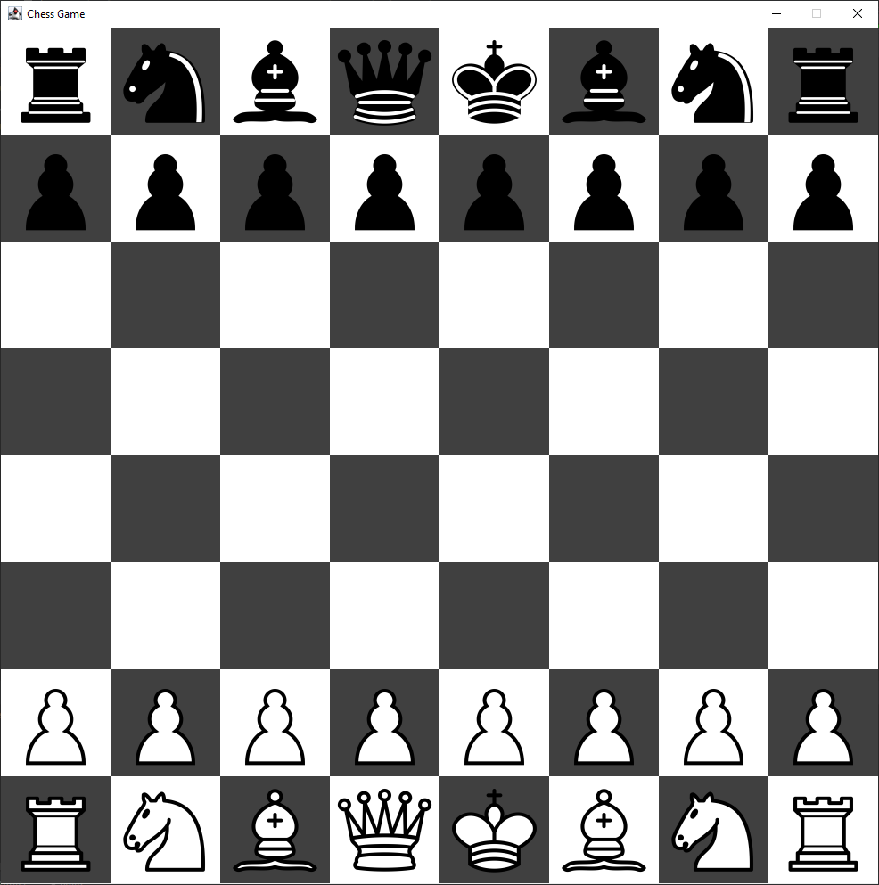
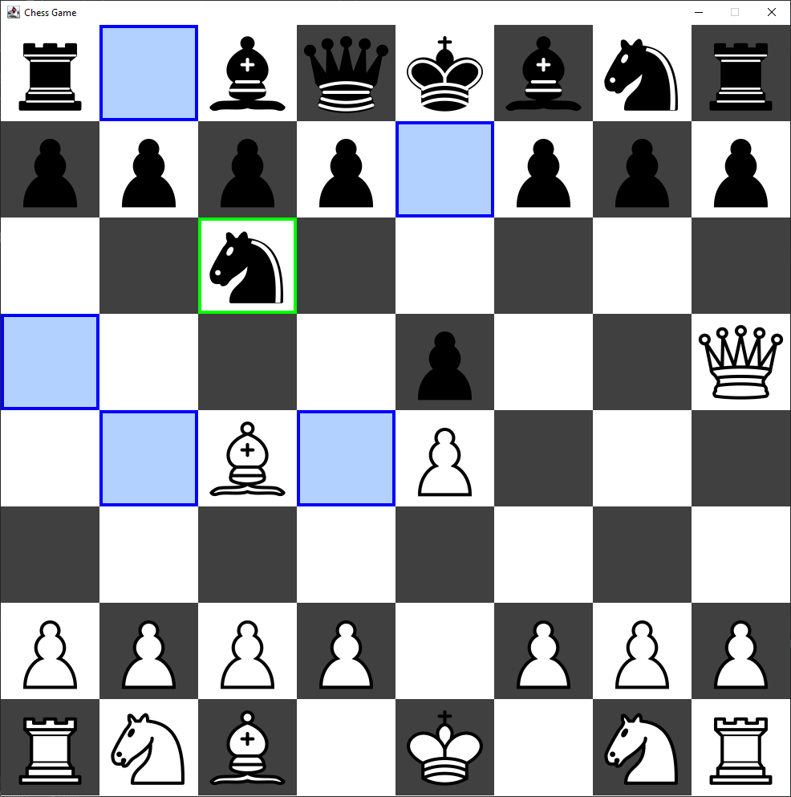
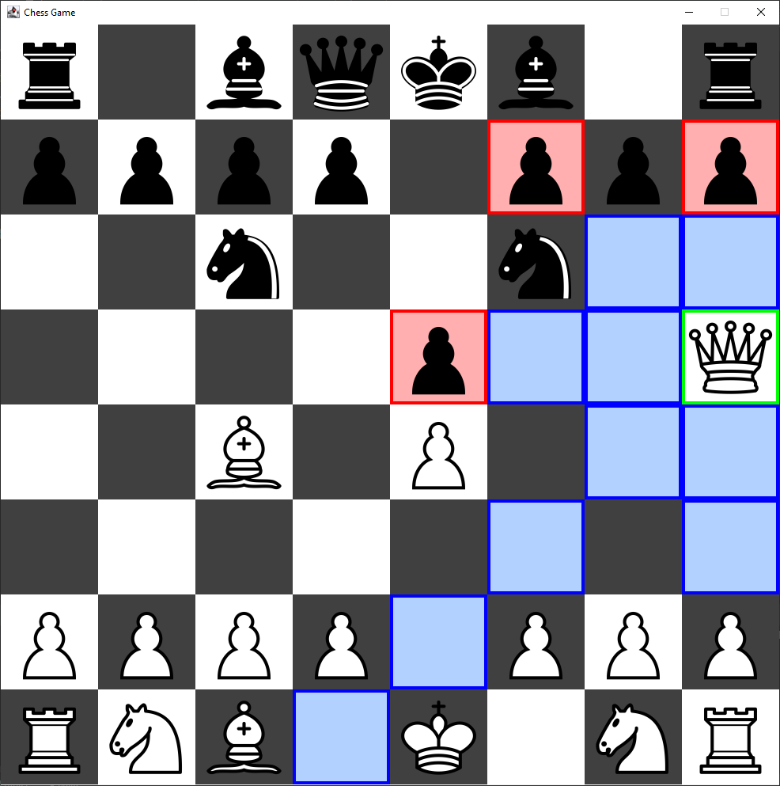
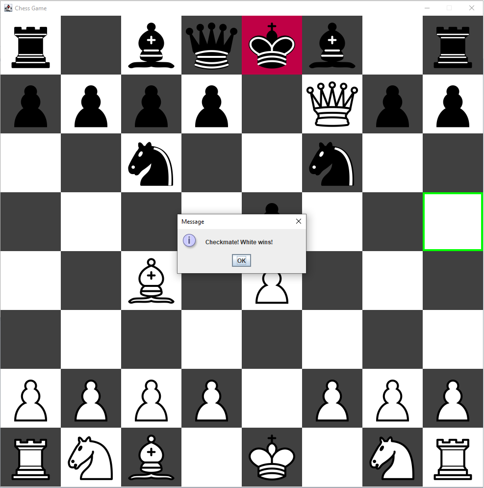
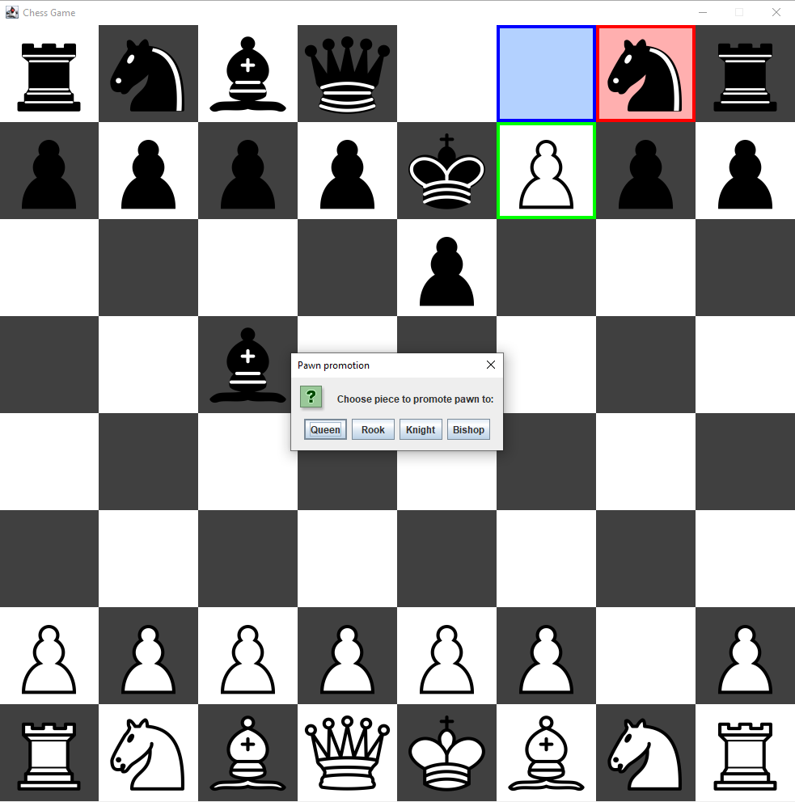

# Chess Game

Fully functional chessboard with all classic chess rules, moves and special moves like castle or en passant.

## Table of Contents

- [Technologiy and installation](#technology-and-installation)
- [Preview](#preview)
- [Author](#author)

## Technology and installation

-  Whole app is written in Java, simply pull it to an IDE like IntelliJ IDEA and hit "Run"

## Preview

1. Start of the game:

   

2. Move previews:

   
   

3. Checkmate:

   

4. Pawn promotion:

   

## Author

Kamil Gowin